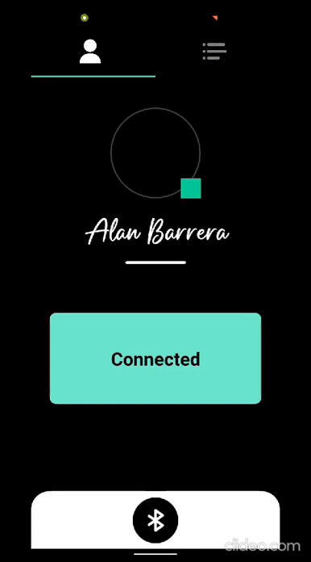
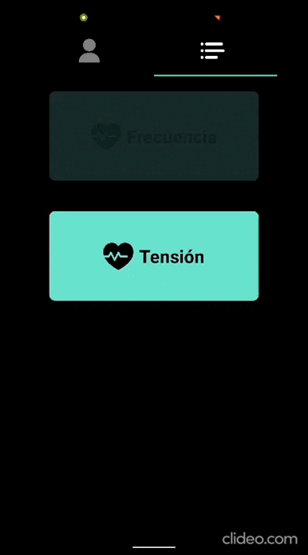

### Avances

Se ha añadido una comunicación Websocket **funcional** al ESP32 y se ha comenzado el desarrollo de la intérfaz de conexión.

### Profile | Section

+ La intérfaz que se abre es un componente *modal* de React Native y busca ser la intérfaz en la que se añadirá la IP del servidor Websocket o/y el conexionado Bluetooth. Ese apartado del código *aún está a decidirse.*

---

### List | Section

+ Test de botones UI creados en la anterior Release pero recién mostrado en ésta nueva publicación. El objetivo es desplegar los valores de frecuencia cardíaca en tiempo real cuando se pulse el botón. El botón de tensión arterial es solo un ejemplo; *no se busca añadir tal función*.

